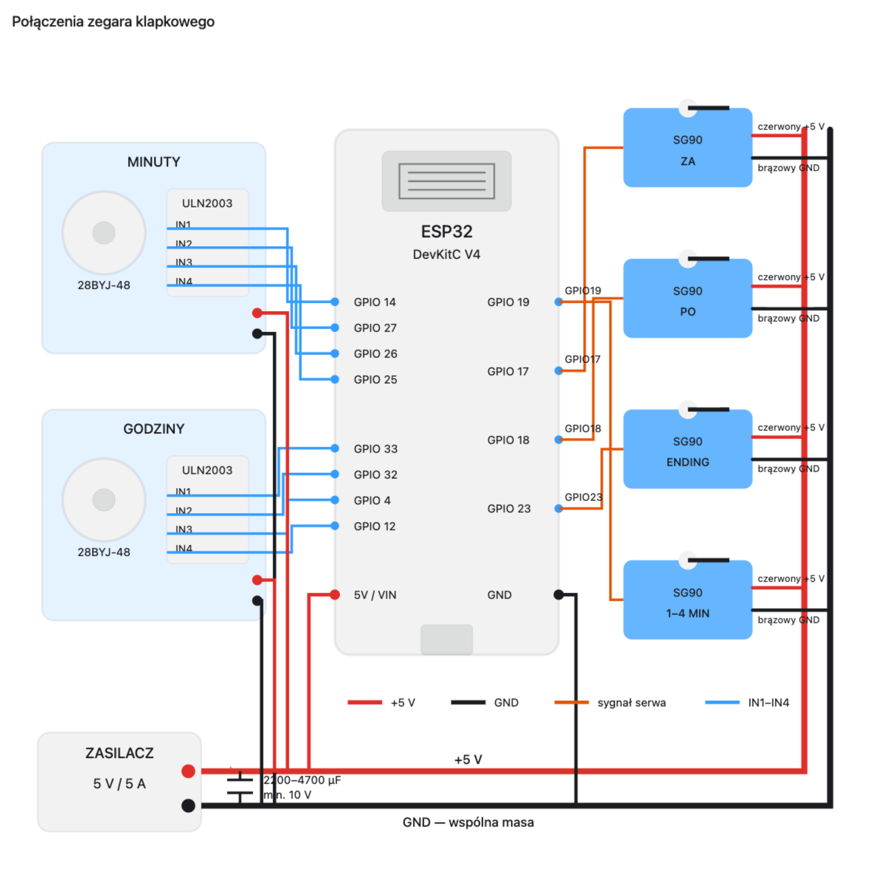

# Zegar klapkowy PL

Polski zegar słowny z mechanicznymi klapkami, zbudowany na ESP32. Czas jest pobierany z NTP, dwa silniki krokowe ustawiają klapki minutowe i godzinowe, a cztery serwa wybierają dodatkowe człony polskiej frazy.

Projekt udostępnia lokalny panel WWW do ręcznego przesuwania mechanizmu i zapisywania kalibracji. Stan klapek jest przechowywany w pamięci EEPROM, dzięki czemu po restarcie zegar może wrócić do aktualnego wskazania.



## Sprzęt

- ESP32 DevKitC V4
- 2 silniki krokowe 28BYJ-48 5 V
- 2 sterowniki ULN2003
- 4 serwa SG90: `ZA`, `PO`, `ENDING`, `1-4 MIN`
- stabilizowany zasilacz 5 V / 5 A
- kondensator elektrolityczny 2200-4700 uF, co najmniej 10 V
- kondensator ceramiczny 100 nF przy rozdziale zasilania

Nie zasilaj serw ani silników przez pin 3,3 V ESP32. Wszystkie urządzenia muszą mieć wspólną masę. Przewody zasilające serwa i sterowniki ULN2003 najlepiej prowadzić osobno od zasilacza.

## Połączenia

### Silnik klapek minutowych

| ULN2003 | ESP32 |
|---|---:|
| IN1 | GPIO 14 |
| IN2 | GPIO 27 |
| IN3 | GPIO 26 |
| IN4 | GPIO 25 |

### Silnik klapek godzinowych

| ULN2003 | ESP32 |
|---|---:|
| IN1 | GPIO 33 |
| IN2 | GPIO 32 |
| IN3 | GPIO 4 |
| IN4 | GPIO 12 |

### Serwa SG90

| Serwo | Pin sygnałowy ESP32 |
|---|---:|
| ZA | GPIO 17 |
| PO | GPIO 18 |
| ENDING | GPIO 23 |
| 1-4 MIN | GPIO 19 |

Czerwone przewody serw podłącz do zewnętrznego `+5 V`, brązowe do wspólnego `GND`, a pomarańczowe do pinów sygnałowych z tabeli.

## Oprogramowanie

Wymagane biblioteki:

- `AccelStepper`
- `ESP32Servo`

Pozostałe komponenty (`WiFi`, `WebServer`, `ESPmDNS`, `EEPROM`, SNTP) są częścią pakietu płytek ESP32 dla Arduino.

## Konfiguracja Wi-Fi

Przed wgraniem programu otwórz `zegar_klapkowy_PL.ino` i wpisz nazwę oraz hasło swojej sieci w tym miejscu:

```cpp
const char *WIFI_SSID = "WPISZ_NAZWE_WIFI";
const char *WIFI_PASSWORD = "WPISZ_HASLO_WIFI";
```

Nie publikuj własnej wersji szkicu z prawdziwym hasłem do sieci.

## Wgrywanie

1. Otwórz `zegar_klapkowy_PL.ino` w Arduino IDE.
2. Wybierz płytkę zgodną z ESP32 DevKitC V4, np. `ESP32 Dev Module`.
3. Zainstaluj biblioteki `AccelStepper` i `ESP32Servo` przez Library Manager.
4. Uzupełnij `WIFI_SSID` i `WIFI_PASSWORD` w głównym szkicu.
5. Skompiluj i wgraj szkic.
6. Otwórz monitor portu szeregowego z prędkością `115200`, aby odczytać adres IP.

Po połączeniu z Wi-Fi panel powinien być dostępny pod:

```text
http://zegarklapkowypl.local
```

Jeżeli mDNS nie działa w danej sieci lub na urządzeniu, użyj adresu IP wypisanego w monitorze portu szeregowego.

## Pierwsza kalibracja

1. Otwórz panel WWW.
2. Przyciskami ręcznego sterowania ustaw klapki w znanych pozycjach.
3. Na listach wybierz dokładnie te klapki, które są fizycznie widoczne.
4. Kliknij `Zapisz klapki i ustaw aktualny czas`.
5. Zegar zapisze pozycję w EEPROM i zacznie dochodzić do czasu NTP.

Ręczne przesunięcie steppera w panelu włącza tryb kalibracji. Automatyczna praca wraca po zapisaniu widocznych klapek.

## Kolejność ruchów

Żeby zmniejszyć chwilowy pobór prądu, mechanizmy są uruchamiane kolejno z przerwą 500 ms:

1. serwo `1-4 MIN`
2. serwo `ZA`
3. klapki minutowe
4. serwo `PO`
5. klapki godzinowe
6. serwo `ENDING`

## Klapki

Kolejność klapek minutowych:

```text
pusta, pięć, dziesięć, kwadrans, dwadzieścia, dwadzieścia pięć,
w pół do, dwadzieścia pięć, dwadzieścia, kwadrans, dziesięć, pięć
```

Kolejność klapek godzinowych odpowiada fizycznym rdzeniom słów zastosowanym w tej konstrukcji i jest zdefiniowana w tablicy `HOUR_FLAP_LABELS` w szkicu.

## Ważne ograniczenia

- Projekt nie ma krańcówek ani czujników pozycji. ESP32 zna pozycję tylko na podstawie liczby wykonanych kroków.
- Po ręcznym obróceniu mechanizmu, poślizgu albo zgubieniu kroków trzeba ponownie wykonać kalibrację.
- Panel WWW nie ma uwierzytelniania i powinien być dostępny wyłącznie w zaufanej sieci lokalnej.
- Wartości `STEPS_PER_FLAP`, kąty serw, prędkość i przyspieszenie mogą wymagać dostrojenia do konkretnej konstrukcji.
  Kąty serw dla poszczególnych pozycji zapisane są w tablicach:
  
    int posZA[2] = {0, 155};     // blank, ZA
    int posPO[2] = {0, 155};     // blank, PO
    int posEND[3] = {139, 77, 16};  // A, EJ, IEJ
    int pos1_4MIN[5] = {0, 45, 85, 127, 170};  // 0, 1, 2, 3, 4

## Struktura repozytorium

```text
zegar_klapkowy_PL/
├── zegar_klapkowy_PL.ino
├── .gitignore
├── README.md
└── docs/
    └── schemat-polaczen-v2.png
```

## Licencja

Przed publicznym udostępnieniem warto dodać plik `LICENSE`. Wybór licencji zależy od tego, czy pozwalasz innym swobodnie kopiować i modyfikować projekt. Dla otwartych projektów hobbystycznych często wybierana jest licencja MIT, ale nie została dodana automatycznie.
